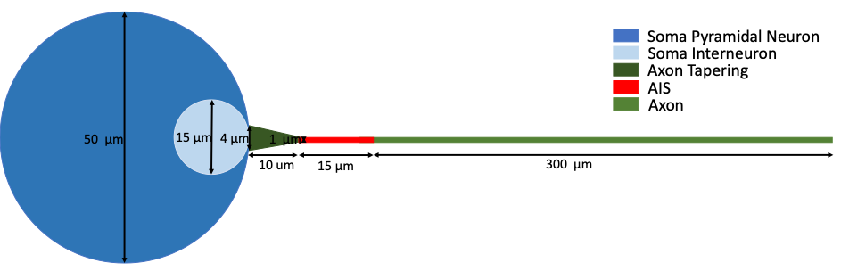

# Barrel-cortex-inhibitory-and-excitatory-neuron-with-AIS

## Background
Two models developed by Eva Koenders to explain the peaks observed in the VC data of our [published dataset (Lantyer et al. 2018)](https://academic.oup.com/gigascience/article/7/12/giy147/5232232). Both models are adapted versions of [Brette (2013)](https://brian2.readthedocs.io/en/2.0rc/examples/frompapers.Brette_2012.Fig1.html). These models show that the peaks in the VC data can be explained as a loss of space clamp at the AIS.

## Model description
Both models are multicompartment models developed in [Brian](https://brian2.readthedocs.io/en/stable/) and consist of 300 compartments that describe the cell soma, axon initial segment (AIS) and axon. 

## References
[1] da Silva Lantyer, A., Calcini, N., Bijlsma, A., Kole, K., Emmelkamp, M., Peeters, M., … Celikel, T. (2018). Supporting data for “A databank for intracellular electrophysiological mapping of the adult somatosensory cortex.” GigaScience. https://doi.org/10.1093/gigascience/giy147

[2] Brette, R. (2013). Sharpness of Spike Initiation in Neurons Explained by Compartmentalization. PLoS Computational Biology, 9(12). https://doi.org/10.1371/journal.pcbi.1003338
